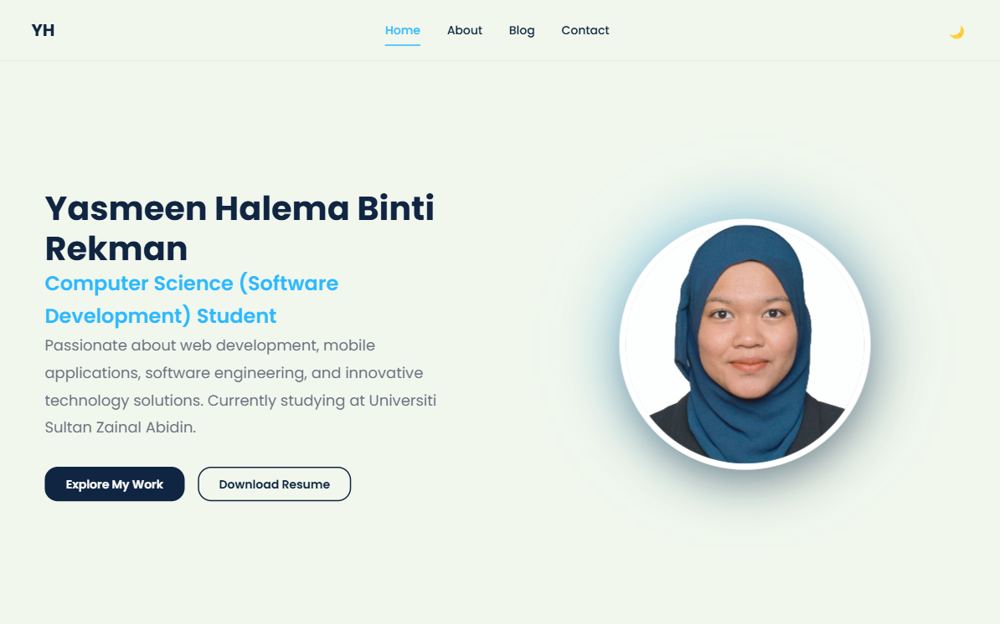
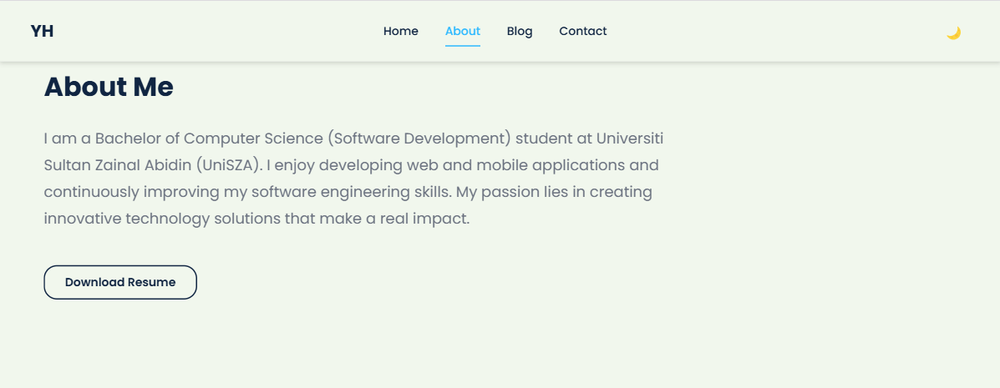
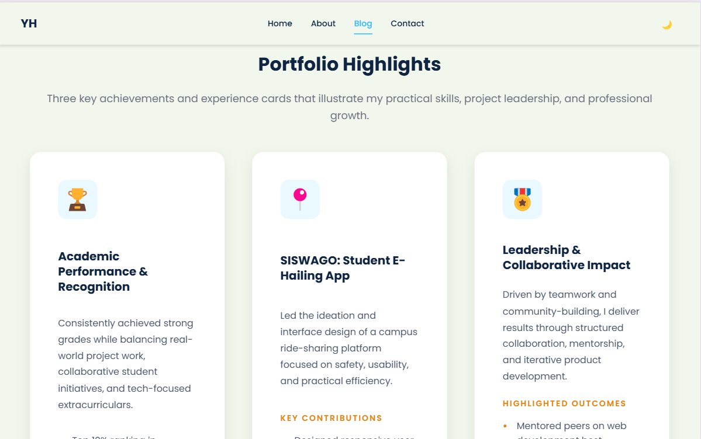
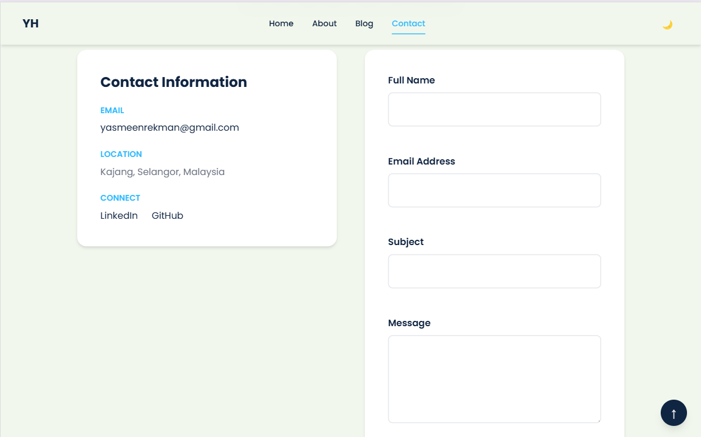

# Portfolio Blog — Yasmeen Halema Binti Rekman

## Project Overview

This project is a personal portfolio and blog website developed as part of the **CSD34203 Special Topics in Software Development** individual assignment.

The website serves as a digital portfolio that showcases my educational background, technical skills, software development projects, achievements, and personal experiences throughout my journey as a Computer Science (Software Development) student.

---

## Author

**Name:** Yasmeen Halema Binti Rekman
**Student ID:** 077088
**Programme:** Bachelor of Computer Science (Software Development) with Honours
**University:** Universiti Sultan Zainal Abidin (UniSZA)

---

## Objectives

* Demonstrate understanding of web development fundamentals.
* Showcase personal achievements and software projects.
* Present technical skills and educational background professionally.
* Build and manage a project using GitHub version control.

---

## Features

### Home Page

* Professional introduction section
* Profile image
* Resume download button
* Skills overview
* Featured project showcase

### About Page

* Personal background
* Education history
* Technical skills
* Career interests

### Experience & Achievements

* Academic and extracurricular achievements
* SISWAGO Final Year Project overview
* Participation in innovation and technology competitions

### Contact Page

* Contact information
* Contact form with validation

### Additional Features

* Responsive design
* Mobile navigation menu
* Dark mode toggle
* Smooth scrolling
* Scroll-to-top button

---

## Technologies Used

### Frontend

* HTML5
* CSS3
* JavaScript

### Design & Development Tools

* Visual Studio Code
* Git & GitHub
* Figma
* Canva

---

## Featured Projects

### SISWAGO

A student-focused e-hailing mobile application developed as a Final Year Project (FYP). The application helps students find affordable and safer transportation around campus.

**Technologies:**

* Ionic Angular
* TypeScript
* Firebase
* Python
* HTML
* CSS

### KLIK

A web-based photo session booking system developed to simplify photography service reservations and management.

**Technologies:**

* HTML
* CSS
* JavaScript
* MySQL

---

## Folder Structure

```text
portfolio-blog/
│
├── index.html
├── about.html
├── blog.html
├── contact.html
│
├── css/
│   └── style.css
│
├── js/
│   └── script.js
│
├── assets/
│   ├── profile.jpg
│   ├── resume.pdf
│   └── screenshots/
│
└── README.md
```

## How to Run

1. Clone or download this repository.
2. Open the project folder in Visual Studio Code.
3. Launch `index.html` using Live Server or any web browser.

Alternative:

```bash
python -m http.server 8000
```

Open:

```text
http://localhost:8000
```

---

## Screenshots

### Home Page



### About Page



### Experience & Achievements



### Contact Page



---

## GitHub Portfolio Assignment

This project was created to fulfill the requirements of the GitHub Portfolio (Personal Blog Page) assignment for:

**Course:** CSD34203 Special Topics in Software Development

The project demonstrates:

* Web development skills
* Portfolio presentation
* GitHub version control usage
* Project documentation practices
* Entrepreneurial and professional development skills

---

## License

This project is created for educational and portfolio purposes only.
